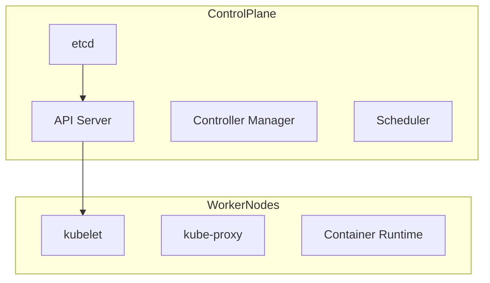
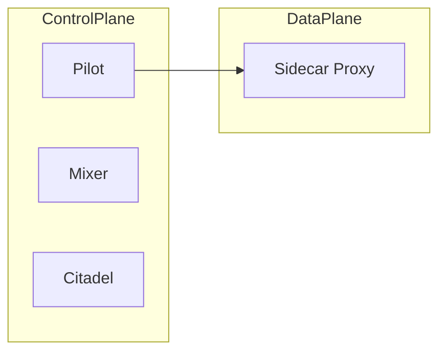
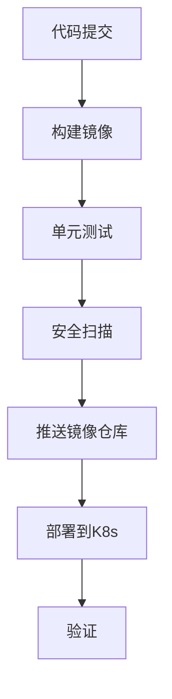
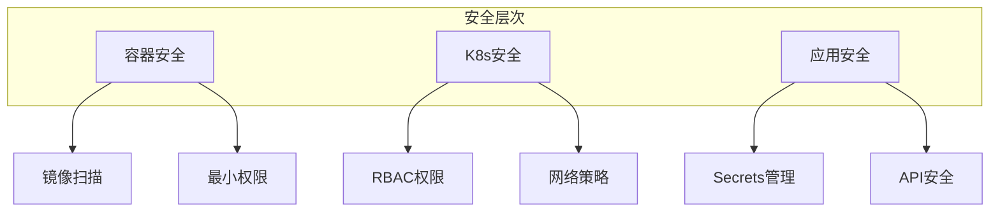

# 云原生实践学习总纲

> 💡 **一句话总结**：从容器化到服务网格，建立云原生知识体系，拓宽架构视野。

## 背景

vebecoding 时代，AI 辅助编程已深度融入开发流程。云原生已成为现代软件架构的基础设施。作为资深 Java 工程师，学习云原生不仅能拓宽技术广度，更能提升架构设计能力。

**学习策略**：循序渐进、速成实践、概念+代码+图示并重。

---

# 目录归档

## 第一章：云原生基础与容器化入门

### 核心概念
- 云原生定义（CNCF 18字箴言）
- 容器化优势与适用场景
- Docker 核心原理：镜像、容器、仓库

### Docker 快速上手
```bash
# 构建第一个云原生应用
docker run -d -p 8080:8080 --name demo eclipse-temurin:17-jre-alpine
docker exec -it demo sh
```

### Dockerfile 最佳实践
```dockerfile
FROM eclipse-temurin:17-jdk-alpine AS builder
WORKDIR /app
COPY pom.xml .
RUN mvn dependency:go-offline
COPY . .
RUN mvn package -DskipTests

FROM eclipse-temurin:17-jre-alpine
WORKDIR /app
COPY --from=builder /app/target/*.jar app.jar
ENTRYPOINT ["java", "-jar", "app.jar"]
```

---

## 第二章：Kubernetes 核心架构

### K8s 集群架构


### 核心资源对象
| 对象 | 作用 |
|------|------|
| Pod | 最小调度单元 |
| Deployment | 无状态应用管理 |
| StatefulSet | 有状态应用管理 |
| Service | 服务发现与负载均衡 |
| ConfigMap/Secret | 配置管理 |

### 快速部署 Spring Boot 应用
```yaml
apiVersion: apps/v1
kind: Deployment
metadata:
  name: springboot-app
spec:
  replicas: 3
  selector:
    matchLabels:
      app: springboot
  template:
    metadata:
      labels:
        app: springboot
    spec:
      containers:
      - name: app
        image: myapp:1.0
        ports:
        - containerPort: 8080
---
apiVersion: v1
kind: Service
metadata:
  name: springboot-svc
spec:
  selector:
    app: springboot
  ports:
  - port: 80
    targetPort: 8080
  type: ClusterIP
```

---

## 第三章：微服务架构实践

### 微服务设计原则
- 领域驱动设计（DDD）入门
- 服务拆分策略
- 前后端分离与 API Gateway

### Spring Cloud 微服务快速搭建
```java
// 服务注册与发现
@SpringBootApplication
@EnableEurekaServer
public class EurekaServerApplication {
    public static void main(String[] args) {
        SpringApplication.run(EurekaServerApplication.class, args);
    }
}

// 服务消费者
@RestController
public class ConsumerController {
    @Autowired
    private RestTemplate restTemplate;
    
    @GetMapping("/call")
    public String callProvider() {
        return restTemplate.getForObject("http://provider-service/hello", String.class);
    }
}
```

### 分布式配置中心
```yaml
spring:
  cloud:
    config:
      uri: http://config-server:8888
      fail-fast: true
```

---

## 第四章：服务网格与流量管理

### Istio 架构概述


### 流量管理核心功能
- **VirtualService**: 路由规则
- **DestinationRule**: 负载均衡策略
- **Gateway**: 入口流量控制

### 流量管理配置示例
```yaml
apiVersion: networking.istio.io/v1beta1
kind: VirtualService
metadata:
  name: reviews
spec:
  hosts:
  - reviews
  http:
  - match:
    - headers:
        end-user:
          exact: jason
    route:
    - destination:
        host: reviews
        subset: v2
  - route:
    - destination:
        host: reviews
        subset: v1
```

---

## 第五章：CI/CD 持续交付

### 云原生 CI/CD 流程


### Jenkinsfile 示例
```groovy
pipeline {
    agent {
        docker {
            image 'maven:3.8-openjdk-17'
        }
    }
    stages {
        stage('Build') {
            steps {
                sh 'mvn clean package -DskipTests'
            }
        }
        stage('Docker') {
            steps {
                sh 'docker build -t myapp:${BUILD_NUMBER} .'
                sh 'docker push myapp:${BUILD_NUMBER}'
            }
        }
        stage('Deploy') {
            steps {
                sh "kubectl set image deployment/myapp app=myapp:${BUILD_NUMBER}"
            }
        }
    }
}
```

---

## 第六章：可观测性体系

### 三大支柱
| 类型 | 工具栈 |
|------|--------|
| 日志 | EFK (Elasticsearch, Fluentd, Kibana) |
| 监控 | Prometheus + Grafana |
| 链路追踪 | Jaeger / Zipkin |

### Spring Boot Actuator 集成
```yaml
management:
  endpoints:
    web:
      exposure:
        include: health,metrics,prometheus
  metrics:
    export:
      prometheus:
        enabled: true
```

---

## 第七章：云原生存储与数据管理

### 存储类型
| 类型 | 用途 | 生命周期 |
|------|------|---------|
| EmptyDir | 临时存储 | 与 Pod 相同 |
| HostPath | 节点存储 | 手动管理 |
| PersistentVolumeClaim | 持久化存储 | 独立于 Pod |
| StorageClass | 动态存储 | 云厂商支持 |

### 数据库云原生部署
```yaml
apiVersion: v1
kind: PersistentVolumeClaim
metadata:
  name: mysql-pvc
spec:
  accessModes:
    - ReadWriteOnce
  resources:
    requests:
      storage: 10Gi
  storageClassName: fast
---
apiVersion: apps/v1
kind: StatefulSet
metadata:
  name: mysql
spec:
  serviceName: mysql
  replicas: 1
  selector:
    matchLabels:
      app: mysql
  template:
    spec:
      containers:
      - name: mysql
        image: mysql:8
        env:
        - name: MYSQL_ROOT_PASSWORD
          valueFrom:
            secretKeyRef:
              name: mysql-secret
              key: password
        volumeMounts:
        - name: data
          mountPath: /var/lib/mysql
  volumeClaimTemplates:
  - metadata:
      name: data
    spec:
      accessModes: ["ReadWriteOnce"]
      resources:
        requests:
          storage: 10Gi
```

---

## 第八章：云原生安全实践

### 安全层次


### 网络策略示例
```yaml
apiVersion: networking.k8s.io/v1
kind: NetworkPolicy
metadata:
  name: api-network-policy
spec:
  podSelector:
    matchLabels:
      app: api
  policyTypes:
  - Ingress
  - Egress
  ingress:
  - from:
    - podSelector:
        matchLabels:
          app: gateway
    ports:
    - protocol: TCP
      port: 8080
```

---

## 学习路径建议

```
Week  1-2: Docker容器化   → 打包现有Java应用
Week  3-4: Kubernetes基础 → 部署应用到K8s集群
Week  5-6: 微服务架构     → Spring Cloud组件
Week  7-8: 服务网格       → Istio流量管理
Week  9-10: CI/CD流水线   → Jenkins/GitLab CI
Week 11-12: 可观测性       → 日志、监控、链路追踪
```

---

## 推荐工具链

| 类别 | 工具 |
|------|------|
| 容器化 | Docker, Podman, Buildpacks |
| 编排 | Kubernetes, K3s, Minikube |
| 服务网格 | Istio, Linkerd |
| CI/CD | Jenkins, GitLab CI, ArgoCD |
| 监控 | Prometheus, Grafana, Thanos |
| 日志 | ELK, Loki, Fluentd |
| 本地开发 | Docker Desktop, Lens, K9s |

---

## 路线选择

| 你的情况 | 推荐路线 |
|---------|---------|
| 零基础入门 | 基础线：容器化 → K8s → 微服务 |
| 有 Docker 经验 | 进阶线：服务网格 → CI/CD → 可观测性 |
| 系统学习 | 全栈线：完整 12 周路径 |

---

> 📌 **说明**：本总纲为云原生学习框架，各章节详细内容将逐步完善。每个章节均包含概念讲解、实战代码、Mermaid 图表，可操作性强。